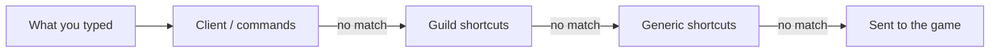

# Commands and shortcuts

While you are **logged in**, the client looks at what you typed **before** sending it to the game. It may open a dialog, run a small automatic sequence, or turn your shortcut into the real game command.

!!! warning "Slash only for client commands"
    Commands that start with **`/`** are for the client (`/help`, `/quit`, `/guilds`, …). **Guild and generic shortcuts do not use a leading slash** (`ucs`, `clw`, …). If you type `/ucs`, the game will usually see that whole line instead of your Disciple shortcut.

## Order of handling

1. **Client `/` commands** — `/help`, `/quit`, `/guilds`, `/generic`, `/settings`, `/raw_logs`
2. **Guild shortcuts** — depend on which guilds you enabled; if two guilds use the same shortcut, the **first** one in your list wins
3. **Generic shortcuts** — cures, navigator, etc., unless you turned them off in settings

If nothing matches, your line is sent to the game unchanged.

## Client `/` commands

| Command | Needs login | What it does |
|---------|-------------|----------------|
| `/help` | no | Shows client slash commands |
| `/quit` | no | Closes the client |
| `/guilds` | yes | Opens the guild picker |
| `/generic` | yes | Opens generic shortcut groups |
| `/settings` | yes | Opens the settings editor |
| `/raw_logs` | no | Toggles raw log capture |

## Generic shortcut groups

These groups can be limited in your settings file. Internal names (for `enabled_groups`) are in the first column.

| Config name | In the UI | Shortcuts |
|-------------|-----------|-----------|
| `cure_spells` | Cure spells | `clw`, `csw`, `clwf`, `cswf` |
| `common_spells` | Common spells | `cww`, `cinv`, `cinf` |
| `navigator` | Navigator | `ctwe`, `ctw`, `cr`, `chw` |
| `common_skills` | Common skills | `ufb`, `camp` |
| `misc` | Misc | `lich_rip`, `normal_rip`, `dig_rip` |

If **`enabled_groups`** is left **empty**, every group is on. If you list names, only those groups are on. **`disabled_commands`** turns off single shortcuts even when their group is on.

## When two guilds share a shortcut

Examples: `cs`, `med`, `ip`, `cb`, `us`. Only **one** guild can own each shortcut. Put the guild you care about **first** in `/guilds`, or avoid pairing guilds that fight over the same letters.

## See also

- [Player settings](player-settings.md) for `rig` and generic groups.
- [Guilds](../guilds/index.md) for each guild’s shortcut list.
